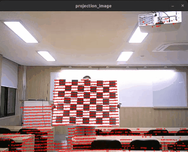
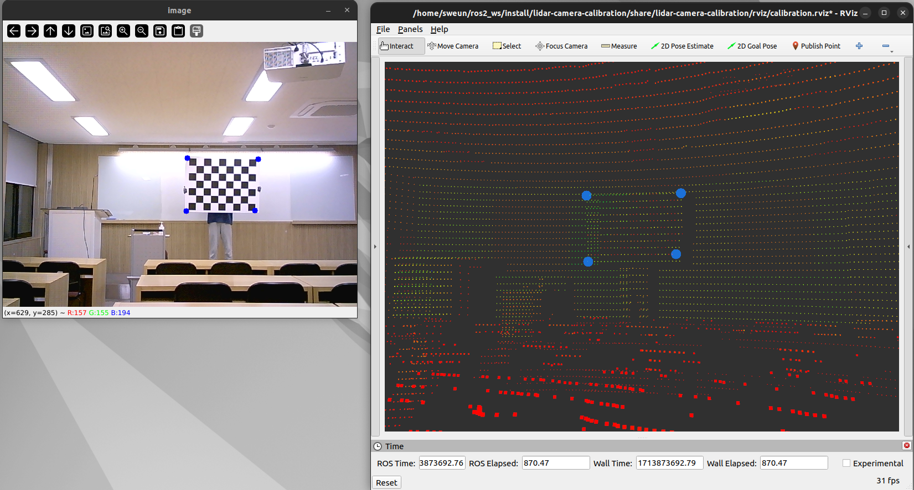

# LiDAR-Camera Calibration
Light-weight Target-based lidar-camera calibraiton based on ROS2 

**Author : sweunwave**



## Environment
Ubuntu 22.04  
ROS Humble  

## Setup
first of all, have to get the camera intrisic parameters
### 1. Run the following to camera calibration
### [ROS-Camera-Calibration Document](https://docs.ros.org/en/rolling/p/camera_calibration/tutorial_mono.html)
```
sudo apt install ros-$DISTRO-camera-calibration
```
### 2. Edit the ```params/camera_intrinsic.json``` from step 1 result
```json
{
    "intrinsic_matrix": [
        [
            741.158280,
            0.000000,
            307.585025
        ],
        [
            0.000000,
            734.406873,
            233.460789
        ],
        [
            0.000000,
            0.000000,
            1.000000
        ]
    ],
    "dist_coeffs": [
        [
            0.000000,
            0.000000,
            0.000000,
            0.000000
        ]
    ]
}
```
### 3. Prepare the rosbag file
You must include two topics below.
```
* /ouster/points [sensor_msgs/msg/PointCloud2]
* /camera1/image_raw [sensor_msgs/msg/Image]
```

## Start Guide
### 1. Install repository<br/>
```
git clone https://github.com/sweunwave/lidar-camera-calibration.git
```

### 2. Colcon build
```
cd ~/your_ws
colcon build --symlink-install --cmake-args -DCMAKE_BUILD_TYPE=Release --packages-select lidar-camera-calibration
```

### 3. Play rosbag file
```
ros2 bag play your-ros-bag-file
```

### 4. Run calibration.launch.py
```
ros2 launch lidar-camera-calibration calibration.launch.py
```
### [LiDAR-Camera calibration user interface demo](https://www.youtube.com/watch?v=qBrfR-YOHWM)



* Mouse Left
  * Select OpenCV pixel
  * Select PointCloud on RVIZ2 (activate **Publish Point**)
* CTRL + Mouse Left
  * Remove the recently selected points
* Mouse Middle(Wheel)
  * Save the selected points of the scene
* CTRL + Mouse Middle(Wheel)
  * Calculate the PnPsolve (get transformation matrix)

### 5. Run Projection.launch.py
```
ros2 launch lidar-camera-calibration projection.launch.py
```

## To-Do-List
- [ ] Source Optimization
- [ ] Robust Calibration
- [ ] . . . . . . . . . . . . . . . . . . . .